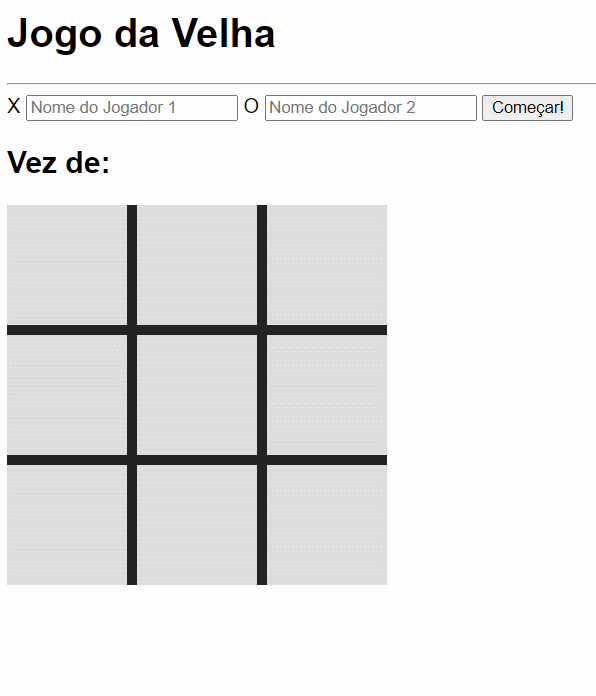

<h1 id="title" align="center">
  Tic Tac Toe 🎯
</h1>

## 💻 Detalhes do projeto

Aplicação desenvolvida no curso [Programador Fullstack OneBitCode](https://pro.onebitcode.com/). Consiste em um jogo da velha que faz a inserção dos jogadores, onde verificar o vencedor, empate e marca qual foi a sequência vencedora.

<h1 align="center">
    
</h1>

## 📚 Informações sobre o projeto

Criada no intuito de praticar os conhecimentos passados no curso sendo HTML, CSS e Javascript que é o foco do curso. O jogo tem por objetivo em marcar um símbolo X ou O, o vencedor é aquela que formar primeiro uma linha, coluna ou diagonal. 

## :rocket: Tecnologias utilizadas no projeto

As tecnologias/ferramentas utilizadas no projeto foram:

- [HTML5](https://developer.mozilla.org/en-US/docs/Web/Guide/HTML/HTML5)
- [CSS3](https://developer.mozilla.org/en-US/docs/Web/CSS)
- [JavaScript](https://developer.mozilla.org/en-US/docs/Web/JavaScript)

## 👨🏻‍💻 Lista de ajustes e melhorias a serem feitas

O projeto ainda está em desenvolvimento e as próximas atualizações serão voltadas nas seguintes tarefas listadas abaixo:

- [ ] Melhorar o layout
- [ ] Colocar ranking de jogadores
- [ ] Fazer opções de jogos nas opções: melhor de 1, 3 e 5
- [ ] Jogador contra o computador ou humano
- [ ] Gravar o número de vítorias por jogador
- [ ] Mostrar mensagem para reiniciar o jogo
- [ ] Subir aplicação para jogar online

## :package: Como utilizar o projeto

É preciso ter instalado no computador o [Git](https://git-scm.com) e o [Node.js](https://nodejs.org/) para clonar e executar o projeto. O projeto pode ser baixado com as linhas de comando ou no formato zip clicando no botão "Code" na opção "Download ZIP"

```bash

    # Clonar o repositório
    $ git clone https://github.com/alexvieirasj/onebitcode-tic-tac-toe

    # Entrar no diretório baixado
    $ cd onebitcode-tic-tac-toe

    # Para executar a aplicação abra o arquivo tic-tac-toe.html no seu navegador
    
    # running on localhost
```

## 🤝 Colaboradores

Agradecemos às seguintes pessoas que contribuíram para este projeto:

<table>
  <tr>
    <td align="center">
      <a href="#">
        <br>
        <sub>
          <b>Alex Vieira</b>
        </sub>
      </a>
    </td>
  </tr>
</table>

## 😄 Seja um dos contribuidores<br>

Quer fazer parte desse projeto? Clique [AQUI](CONTRIBUTING.md) e leia como contribuir.

## 📝 Licença

Esse projeto está sob licença. Veja o arquivo [LICENÇA](LICENSE.md) para mais detalhes.

[⬆ Voltar ao topo](#title)
